# Neural Network for Digit Classification (MNIST) using NumPy
This project implements a feedforward neural network from scratch using NumPy to classify handwritten digits from the MNIST dataset. The model is designed to explore the impact of various hyperparameters on performance, including the number of epochs, optimizer, activation function, learning rate, hidden layer size, and batch size. 

**Important**: this research is not 100% objective, as the test results may vary due to different computer load during the tests, variations in the implementation of the neural network, etc. The essence of the research for me is to understand the dependencies between the parameters of neural network training and to find the optimal variant for solving the task at hand.

## Project Structure
- `main.py`: main script for loading data, training models, and generating visualizations;
- `model.py`: implementation of the neural network, including forward/backward propagation, optimizers, and activation functions;
- `plots.py`: visualization utilities for plotting training/validation metrics and predictions;
- `data/train.csv`: MNIST dataset in CSV format;
- `logs/`: directory for storing training logs;
- `images/`: directory for storing results of the testing model parameters.

## Model Architecture
The neural network is a two-layer feedforward network:
- **Input Layer**: 784 neurons (28x28 pixel images flattened);
- **Hidden Layer**: configurable number of neurons;
- **Output Layer**: 10 neurons (one for each digit, 0-9);
- **Loss Function**: Cross-entropy loss;
- **Output Activation**: Softmax (for training) and ArgMax (for predicting);
- **Hidden Layer Activations**: Sigmoid, tanh, ReLU, Leaky ReLU, ELU;
- **Optimizers**: Gradient Descent, Momentum, Nesterov (simplified version), RMSprop, Adam.

The model supports batch training, model performance averaging over multiple runs, early stopping based on validation loss to prevent overfitting and logs training progress to both console and files.  

The parameters `patience` and `min_delta` are required for tuning the early stopping algorithm and are not considered in this research.

## Data Preprocessing
The MNIST dataset is loaded from `data/train.csv`, contain 10 samples and split into:
- **Validation Set**: configurable (by default 6000 samples);
- **Test Set**: configurable (by default 2000 samples);
- **Training Set**: remaining samples (by default, 34000).

Pixel values are normalized to [0, 1] by dividing by 255. Labels are one-hot encoded for training.

## Investigating Parameter Effects on Model Performance
Optimizer tests are conducted with `learning_rate = 0.001` and `learning_rate = 0.0001` respectively. All other tests use Nesterov optimizer as a demonstration of a simpler solution and Adam as one of the best algorithms. All model parameters are shown at the top of the images. The first image shows the result of model training and validation, and the second image shows the result of testing. The results of model training and testing are averages over 10 full stages of model training and testing.

### 1. Optimizers (`learning_rate = 0.001` with early stopping)
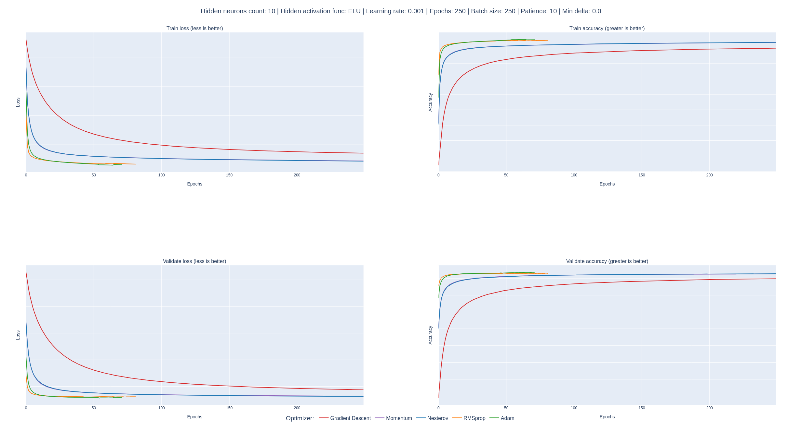
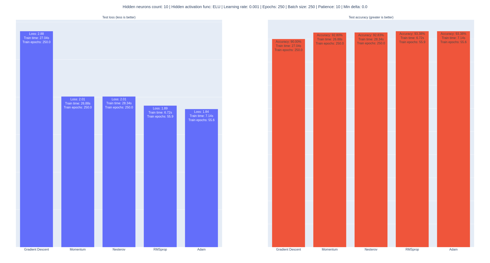

| Optimizer        | Train time | Epochs | Test loss | Test accuracy |
|------------------|------------|--------|-----------|---------------|
| Gradient Descent | 27.04s     | 250.0  | 2.88      | 90.00%        |
| Momentum         | 26.88s     | 250.0  | 2.01      | 92.80%        |
| Nesterov         | 28.34s     | 250.0  | 2.01      | 92.83%        |
| RMSprop          | 6.72s      | 55.9   | 1.89      | 93.38%        |
| Adam             | 7.14s      | 55.6   | 1.84      | 93.38%        |

**Conclusions:**  
Best train time: RMSprop  
Best test accuracy: RMSprop and Adam  
Optimal options: RMRprop or Adam  

### 2. Optimizers (`learning_rate = 0.0001` with early stopping)
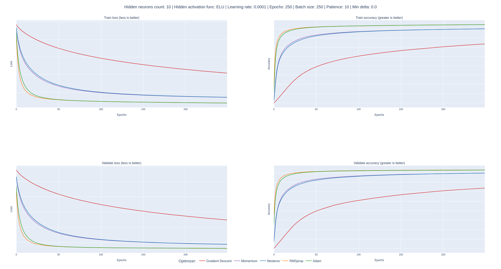
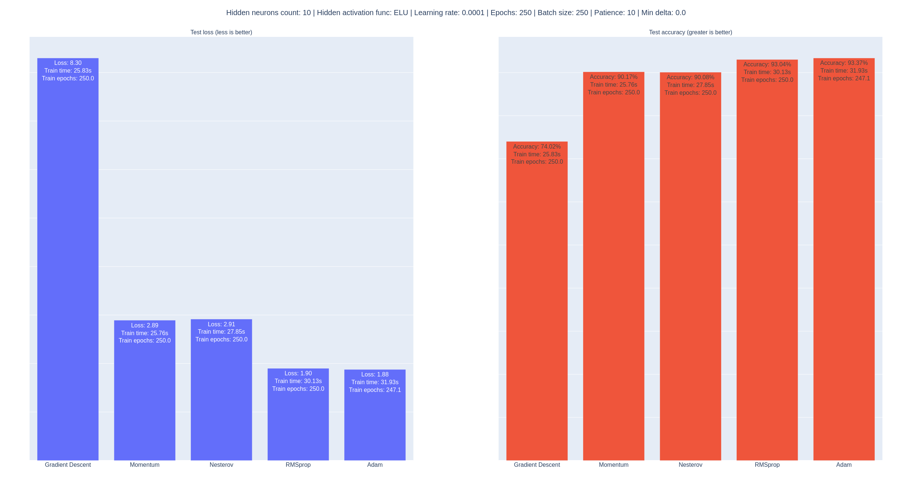

| Optimizer        | Train time | Epochs | Test loss | Test accuracy |
|------------------|------------|--------|-----------|---------------|
| Gradient Descent | 25.83s     | 250.0  | 8.30      | 74.02%        |
| Momentum         | 25.76s     | 250.0  | 2.89      | 90.17%        |
| Nesterov         | 27.85s     | 250.0  | 2.91      | 90.08%        |
| RMSprop          | 30.13s     | 250.0  | 1.90      | 93.04%        |
| Adam             | 31.93s     | 247.1  | 1.88      | 93.37%        |

**Conclusions:**  
Best train time: Momentum  
Best test accuracy: Adam  
Optimal options: RMSprop or Adam  

### 3. Hidden Layer Activation Functions (Nesterov with early stopping)
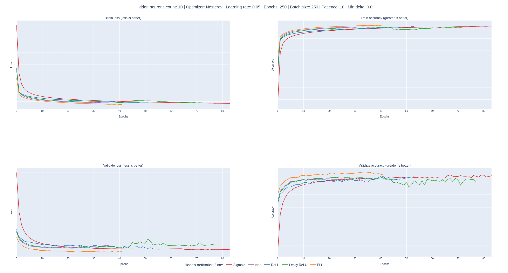
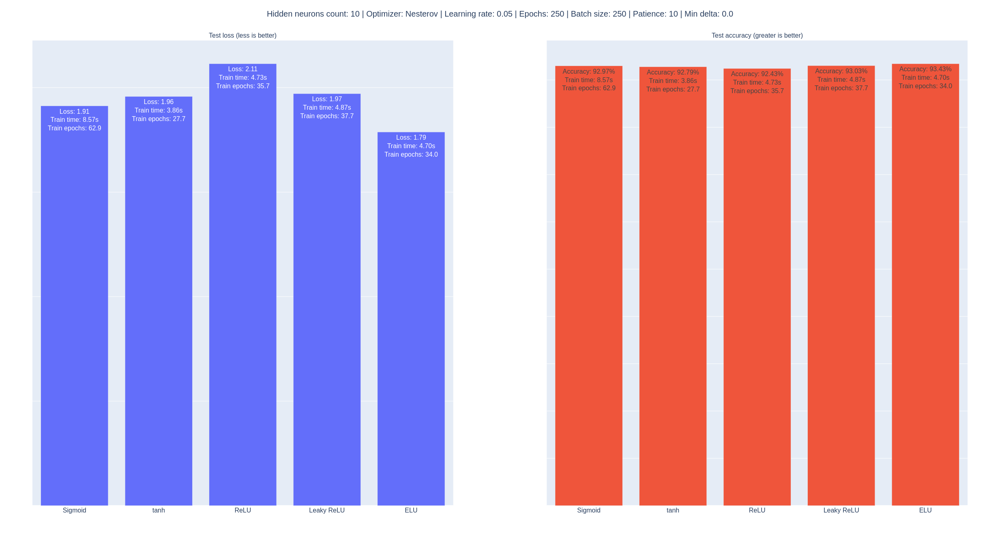

| Activation function | Train time | Epochs | Test loss | Test accuracy |
|---------------------|------------|--------|-----------|---------------|
| Sigmoid             | 8.57s      | 62.9   | 1.91      | 92.97%        |
| tanh                | 3.86s      | 27.7   | 1.96      | 92.79%        |
| ReLU                | 4.73s      | 35.7   | 2.11      | 92.43%        |
| Leaky ReLU          | 4.87s      | 37.7   | 1.97      | 93.03%        |
| ELU                 | 4.70s      | 34.0   | 1.79      | 93.43%        |

**Conclusions:**  
Best train time: tanh  
Best test accuracy: ELU  
Optimal options: tanh or ELU  

### 4. Hidden Layer Activation Functions (Adam with early stopping)
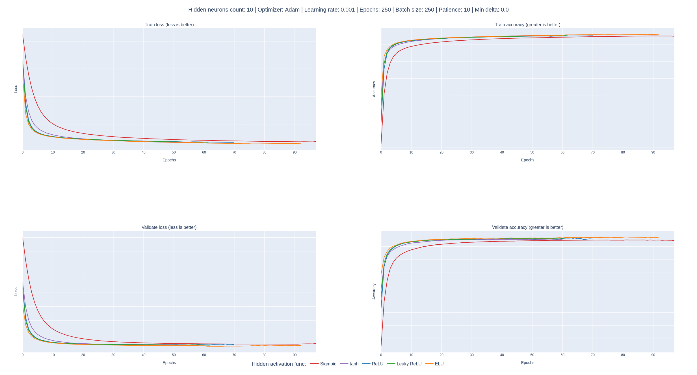
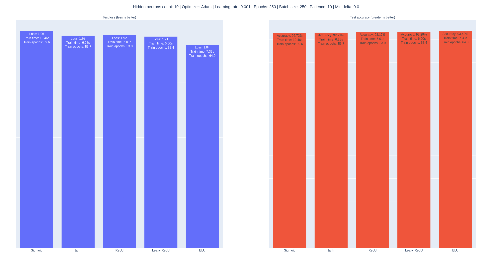

| Activation function | Train time | Epochs | Test loss | Test accuracy |
|---------------------|------------|--------|-----------|---------------|
| Sigmoid             | 10.46s     | 89.6   | 1.96      | 92.72%        |
| tanh                | 6.28s      | 53.7   | 1.92      | 92.91%        |
| ReLU                | 6.01s      | 53.0   | 1.92      | 93.17%        |
| Leaky ReLU          | 6.00s      | 55.4   | 1.91      | 93.29%        |
| ELU                 | 7.33s      | 64.0   | 1.84      | 93.49%        |

**Conclusions:**  
Best train time: ReLU and Leaky ReLU  
Best test accuracy: ELU  
Optimal options: ReLU and Leaky ReLU  

### 5. Learning rate (Nesterov without early stopping)
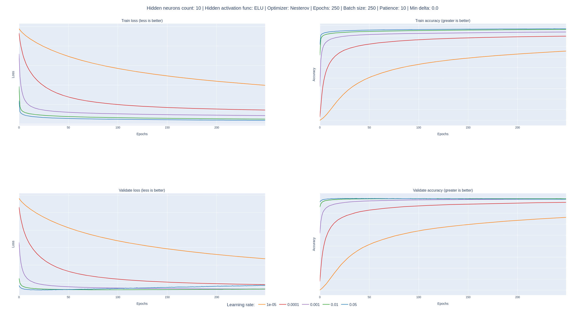
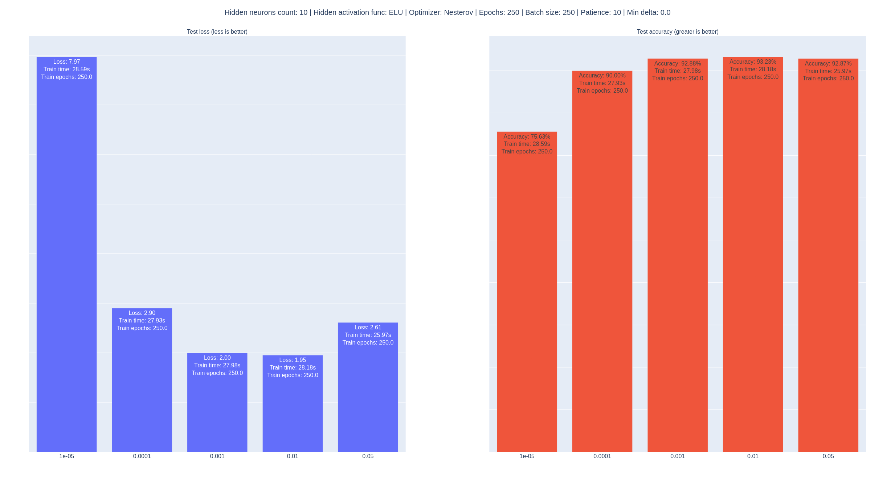

| Learning rate | Train time | Epochs | Test loss | Test accuracy |
|---------------|------------|--------|-----------|---------------|
| 0.00001       | 28.59s     | 250.0  | 7.97      | 75.63%        |
| 0.0001        | 27.93s     | 250.0  | 2.90      | 90.00%        |
| 0.001         | 27.98s     | 250.0  | 2.00      | 92.88%        |
| 0.01          | 28.18s     | 250.0  | 1.95      | 93.23%        |
| 0.05          | 25.97s     | 250.0  | 2.61      | 92.87%        |

**Conclusions:**  
Best train time: 0.05  
Best test accuracy: 0.01  
Optimal option: 0.01  

### 6. Learning rate (Nesterov with early stopping)
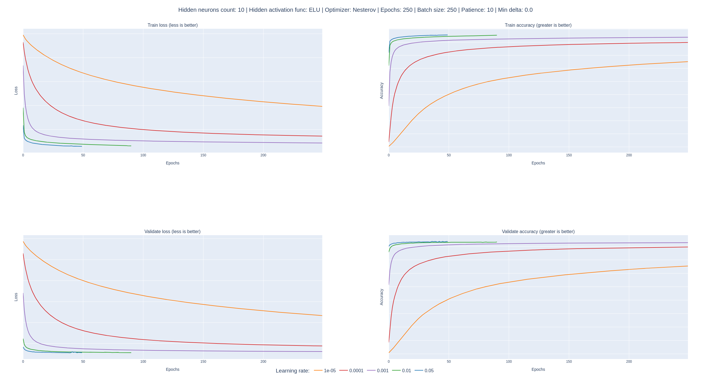
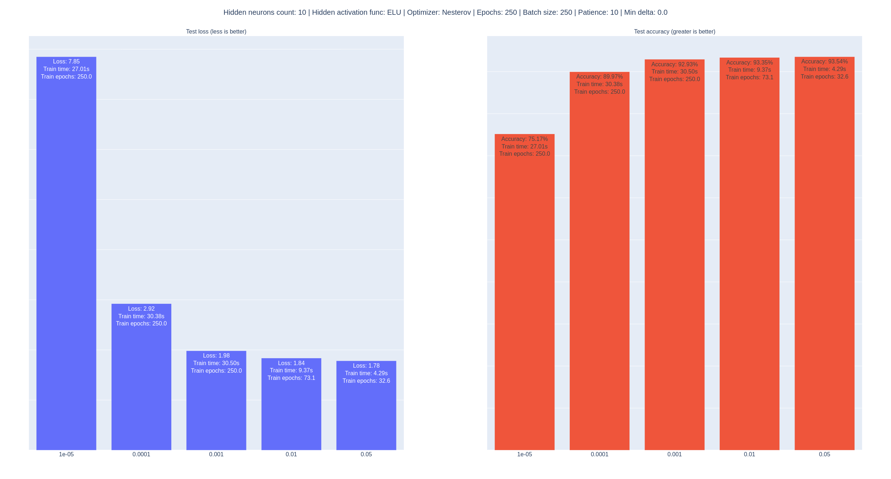

| Learning rate | Train time | Epochs | Test loss | Test accuracy |
|---------------|------------|--------|-----------|---------------|
| 0.00001       | 27.01s     | 250.0  | 7.85      | 75.17%        |
| 0.0001        | 30.38s     | 250.0  | 2.92      | 89.97%        |
| 0.001         | 30.50s     | 250.0  | 1.98      | 92.93%        |
| 0.01          | 9.37s      | 73.1   | 1.84      | 93.35%        |
| 0.05          | 4.29s      | 32.6   | 1.78      | 93.54%        |

**Conclusions:**  
Best train time: 0.05  
Best test accuracy: 0.05  
Optimal option: 0.05  

### 7. Learning rate (Adam without early stopping)
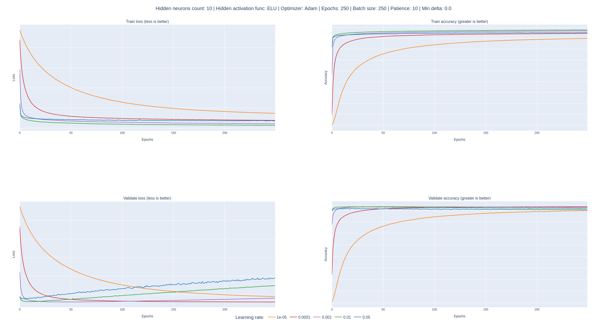
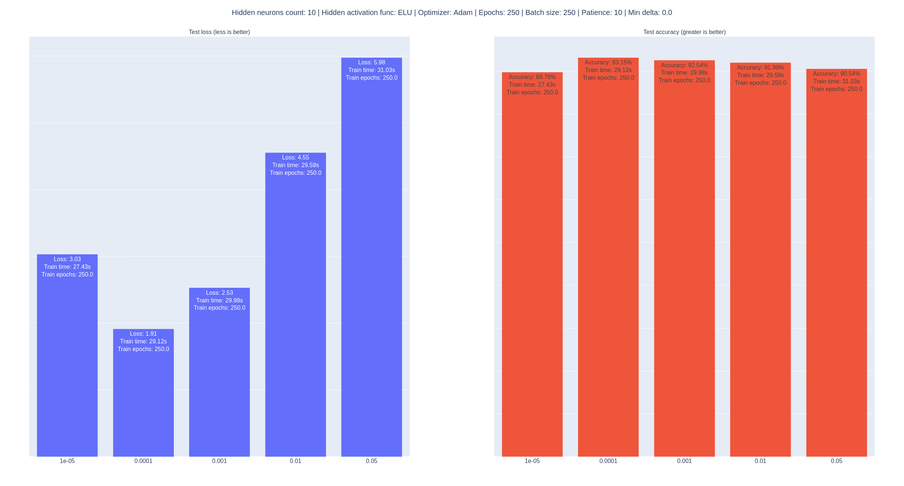

| Learning rate | Train time | Epochs | Test loss | Test accuracy |
|---------------|------------|--------|-----------|---------------|
| 0.00001       | 27.43s     | 250.0  | 3.03      | 89.76%        |
| 0.0001        | 29.12s     | 250.0  | 1.91      | 93.15%        |
| 0.001         | 29.98s     | 250.0  | 2.53      | 92.54%        |
| 0.01          | 29.59s     | 250.0  | 4.55      | 91.99%        |
| 0.05          | 31.03s     | 250.0  | 5.98      | 90.54%        |

**Conclusions:**  
Best train time: 0.00001  
Best test accuracy: 0.0001  
Optimal option: 0.0001  

### 8. Learning rate (Adam with early stopping)
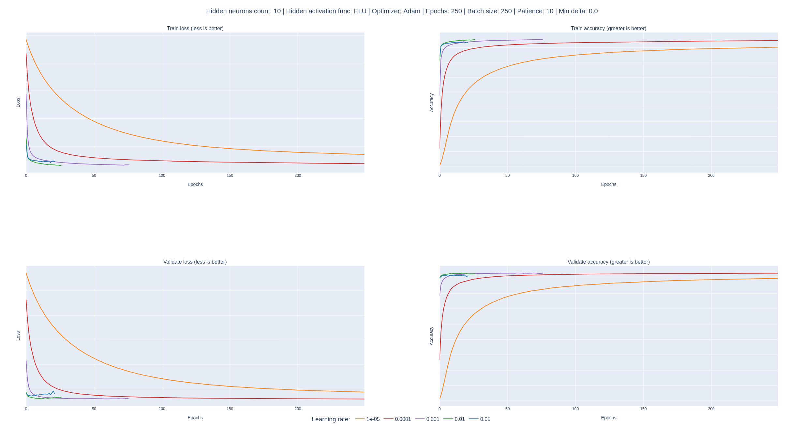
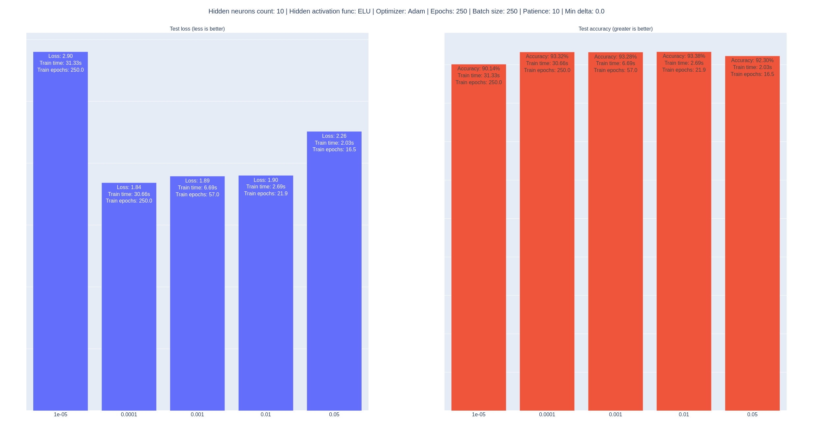

| Learning rate | Train time | Epochs | Test loss | Test accuracy |
|---------------|------------|--------|-----------|---------------|
| 0.00001       | 31.33s     | 250.0  | 2.90      | 90.14%        |
| 0.0001        | 30.66s     | 250.0  | 1.84      | 93.32%        |
| 0.001         | 6.69s      | 57.0   | 1.89      | 93.28%        |
| 0.01          | 2.69s      | 21.9   | 1.90      | 93.38%        |
| 0.05          | 2.03       | 16.5   | 2.26      | 92.30%        |

**Conclusions:**  
Best train time: 0.05  
Best test accuracy: 0.01  
Optimal options: 0.01  

### 9. Hidden layer neurons count (Nesterov with early stopping)
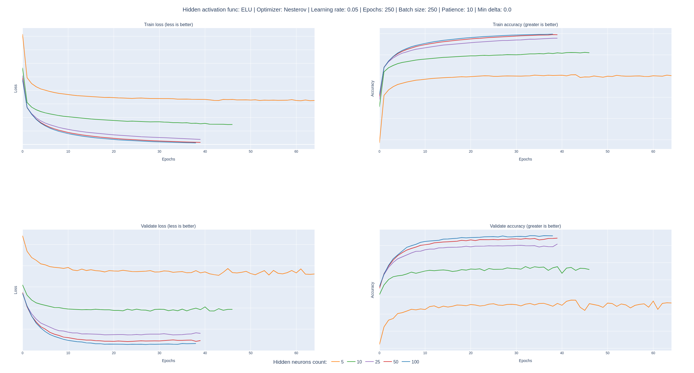
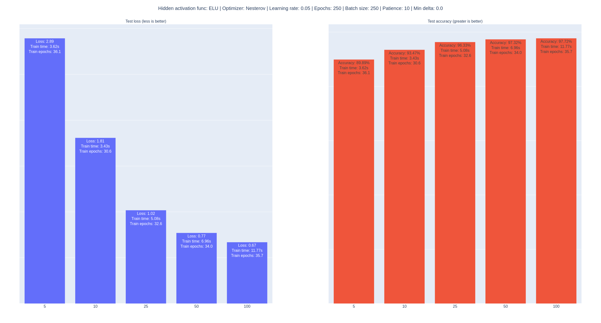

| Hidden neurons count | Train time | Epochs | Test loss | Test accuracy |
|----------------------|------------|--------|-----------|---------------|
| 5                    | 3.62s      | 36.1   | 2.89      | 89.89%        |
| 10                   | 3.43s      | 30.6   | 1.81      | 93.47%        |
| 25                   | 5.08s      | 32.6   | 1.02      | 96.33%        |
| 50                   | 6.96s      | 34.0   | 0.77      | 97.32%        |
| 100                  | 11.77s     | 35.7   | 0.67      | 97.72%        |

**Conclusions:**  
Best train time: 10  
Best test accuracy: 100  
Optimal option: 10  

### 10. Hidden layer neurons count (Adam with early stopping)
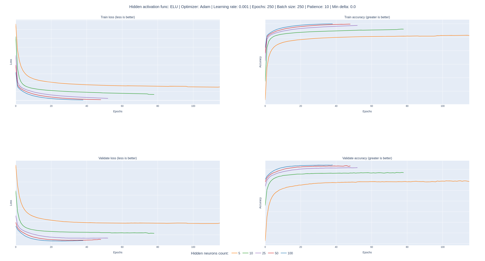
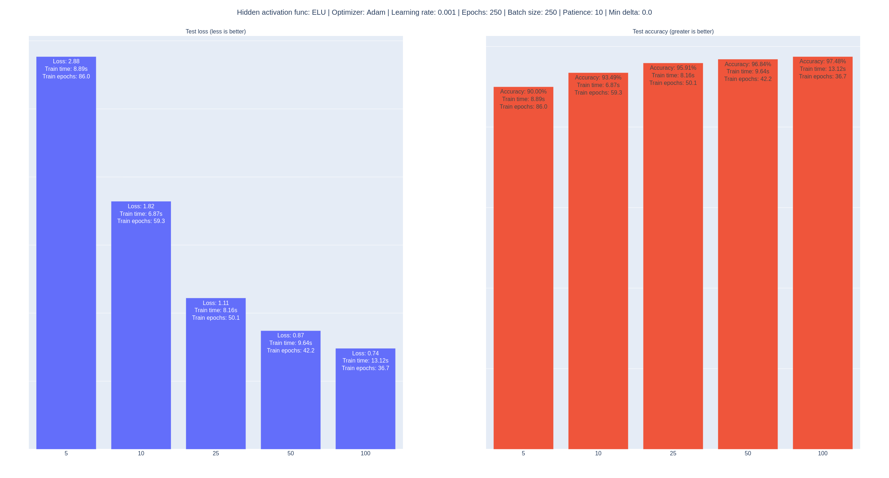

| Hidden neurons count | Train time | Epochs | Test loss | Test accuracy |
|----------------------|------------|--------|-----------|---------------|
| 5                    | 8.89s      | 86.0   | 2.88      | 90.00%        |
| 10                   | 6.87s      | 59.3   | 1.82      | 93.49%        |
| 25                   | 8.16s      | 50.1   | 1.11      | 95.91%        |
| 50                   | 9.64s      | 42.2   | 0.87      | 96.84%        |
| 100                  | 13.12s     | 36.7   | 0.74      | 97.48%        |

**Conclusions:**  
Best train time: 10  
Best test accuracy: 100  
Optimal options: 50  

### 11. Batch size (Nesterov with early stopping)
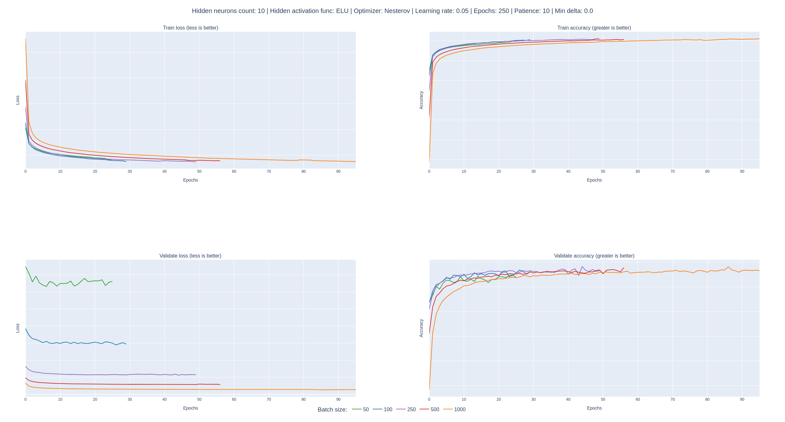
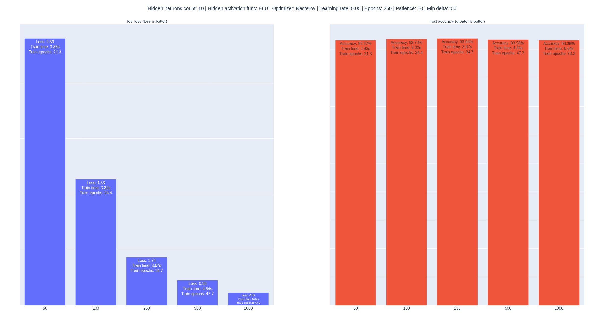

| Batch size | Train time | Epochs | Test loss | Test accuracy |
|------------|------------|--------|-----------|---------------|
| 50         | 3.83s      | 21.3   | 9.59      | 93.37%        |
| 100        | 3.32s      | 24.4   | 4.53      | 93.73%        |
| 250        | 3.67s      | 34.7   | 1.74      | 93.94%        |
| 500        | 4.64s      | 47.7   | 0.90      | 93.58%        |
| 1000       | 6.64s      | 73.2   | 0.46      | 93.38%        |

**Conclusions:**  
Best train time: 100  
Best test accuracy: 250  
Optimal options: 250  


### 12. Batch size (Adam with early stopping)
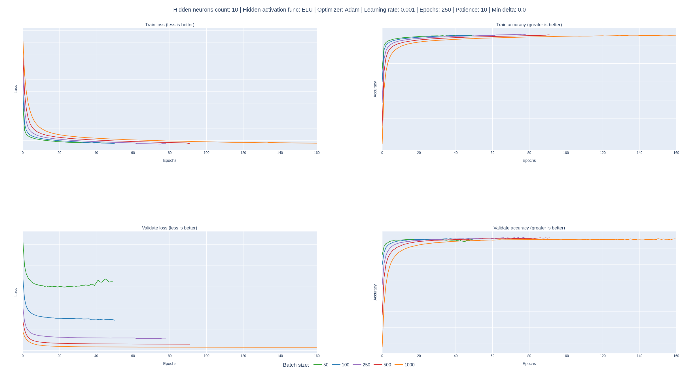
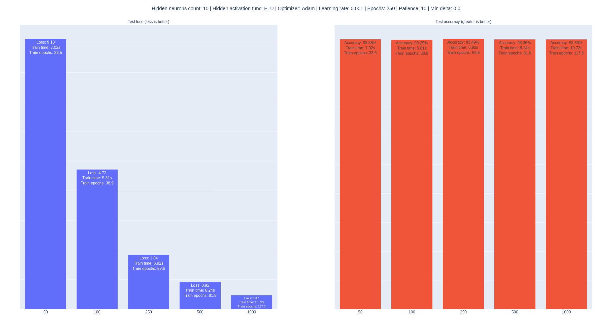

| Batch size | Train time | Epochs | Test loss | Test accuracy |
|------------|------------|--------|-----------|---------------|
| 50         | 7.02s      | 33.5   | 9.13      | 93.38%        |
| 100        | 5.81s      | 38.9   | 4.72      | 93.25%        |
| 250        | 6.92s      | 59.6   | 1.84      | 93.49%        |
| 500        | 8.24s      | 81.9   | 0.92      | 93.36%        |
| 1000       | 10.72s     | 117.6  | 0.47      | 93.36%        |

**Conclusions:**  
Best train time: 100  
Best test accuracy: 250  
Optimal options: 100  

## Setting Up and Running the Project
### Using pip
1. Clone the repository:
```bash
git clone https://github.com/ash1rawtf/numpy-ffnn-classification-mnist.git
cd numpy-ffnn-classification-mnist
```

2. Create and activate a virtual environment:
```bash
python -m venv .venv
# On Windows
.venv\Scripts\activate
# On Unix or MacOS
source .venv/bin/activate
```

3. Install dependencies:
```bash
pip install -r requirements.txt
```

4. Run the model:  
Create and customize the desired model in the `main.py` file and then run it.  
```bash
python main.py
```

### Using uv
1. Clone the repository:
```bash
git clone https://github.com/ash1rawtf/numpy-ffnn-classification-mnist.git
cd numpy-ffnn-classification-mnist
```

2. Create and activate a virtual environment:
```bash
uv venv
# On Windows
.venv\Scripts\activate
# On Unix or MacOS
source .venv/bin/activate
```

3. Install dependencies:
```bash
uv sync
```

4. Run the model:
Create and customize the desired model in the `main.py` file and then run it.  
```bash
python main.py
```
